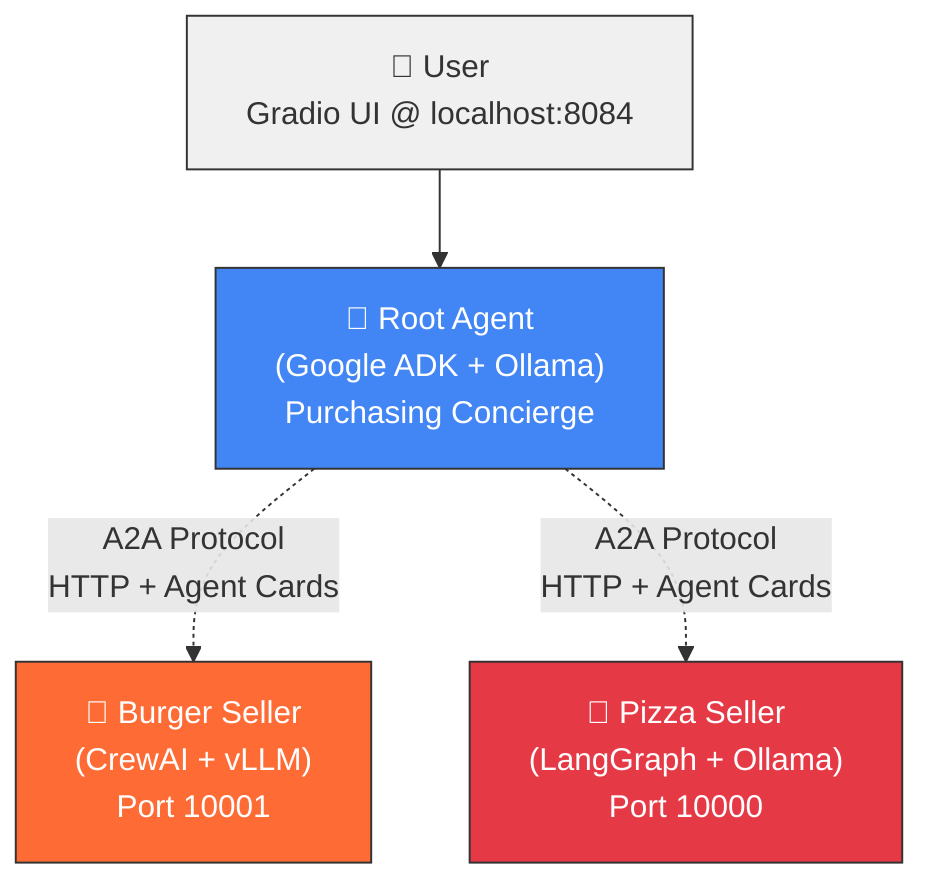

# Multi-Agent Purchasing Concierge — Google ADK + A2A Protocol

> Hands-on lab notes and learnings from building a cross-framework agentic AI system on local Llama 3.1 running on AMD Instinct GPUs.

**Completed as part of the [AMD AI Academy](https://www.amd.com/) tutorial *"Powering Google ADK on AMD Platform and Local LLMs."* This repo captures the architecture, what I learned, and my notes on making the pieces fit together — as a portfolio artifact of my work in agentic AI systems.**

---

## What It Does

A Purchasing Concierge where three specialized agents — each built on a different framework — collaborate over the open **Agent-to-Agent (A2A) Protocol** to take a customer order:

- **Root Agent — Purchasing Concierge** (Google ADK + Ollama)
  Orchestrates the conversation, discovers remote agents, and delegates tasks.
- **Burger Seller Agent** (CrewAI + vLLM)
  Handles burger menu, pricing, and order creation. Uses the classic `Agent → Task → Crew` pipeline.
- **Pizza Seller Agent** (LangGraph + Ollama)
  Handles pizza ordering using LangGraph's ReAct pattern (Reason → Act → Observe).

The Root Agent doesn't know or care which framework the sellers use — it discovers them through **Agent Cards** (JSON metadata documents), authenticates over HTTP, and delegates through A2A. That's the point of the protocol.

The whole stack runs **locally on AMD Instinct GPUs** with a Gradio UI on top.

---

## Architecture

## Stack

| Layer | Tech |
|---|---|
| Orchestration | Google Agent Development Kit (ADK) |
| Agent frameworks | CrewAI, LangGraph |
| Model adapter | LiteLLM |
| Inference servers | vLLM (with tool-calling), Ollama |
| Model | Meta Llama 3.1 8B Instruct |
| Hardware | AMD Instinct GPUs (ROCm) |
| Protocol | A2A (Agent-to-Agent) |
| Structured I/O | Pydantic |
| UI | Gradio |

---

## What I Learned

The point of the exercise wasn't just to get code running — it was to understand *why* the architecture is shaped the way it is. Four things stuck:

### 1. Framework choice becomes an implementation detail
CrewAI is built for structured `Agent → Task → Crew` pipelines. LangGraph is built for cyclical `Reason → Act → Observe` graphs. Google ADK is built to orchestrate. With A2A as the connective tissue, you pick the right framework *per agent* instead of committing to one for the whole system.

### 2. Agent Cards are the underrated primitive
A JSON "business card" that describes what an agent can do, how to reach it, and what authentication it expects. Sounds trivial. It's what makes cross-framework agents actually discoverable at scale — and it's what turns a collection of scripts into a system.

### 3. Tool calling is where LLMs stop being magic and start being useful
The model decides *what* to do. A deterministic Python function with a Pydantic schema actually *does* it. That handoff — intent to action — is the whole game for anything auditable. Structured `Literal` status enums and typed order objects (with UUIDs) make the system's behavior inspectable rather than a black box.

### 4. Local inference is more production-viable than the hype suggests
Running Llama 3.1 8B on vLLM with `--enable-auto-tool-choice` and a Llama 3.1 JSON tool-call parser, plus Ollama running a second copy of the model, on a single GPU — with `--gpu-memory-utilization 0.6` leaving headroom for the second server, context spikes, and system overhead. Fast enough to feel real. No per-token bill.

---

## Key Concepts

**A2A Protocol.** An open standard for how agents discover and talk to each other. Introduces two roles:
- **A2A Client** — initiates a request (the Root Agent, in this system)
- **A2A Server** — exposes an HTTP endpoint, accepts tasks, returns results (the seller agents)

Agents exchange **Tasks** (units of work) made of **Messages**.

**ADK Session / State / Memory.** How ADK keeps conversation coherent:
- **Session** — the current conversation thread
- **State** — scratchpad data scoped to this conversation (cart contents, current preferences)
- **Memory** — searchable knowledge across sessions

**Security posture.** A2A assumes enterprise defaults: HTTPS/TLS, OAuth2 or API keys in HTTP headers, least-privilege authorization, and observability (tracing, logging, monitoring) from day one. Not bolted on afterward.

---

## Related Work

This build is part of my broader focus on **agentic AI systems**. Related projects in my portfolio:

- **CrimeCast Studio** — eleven-agent "Hermes" layer on EC2 handling autonomous case research, verification, and scripting via the Claude Agent SDK
- **Wrongful Conviction Archive** — research-journalism CMS that does deep research → write → cite → SEO in one pipeline
- **Social Autopilot ("The Desk")** — auto-generates and publishes brand-grounded posts across X, Facebook, Instagram, and TikTok

---

## Credits

Original tutorial: **[Powering Google ADK on AMD Platform and Local LLMs](https://github.com/shailensobhee/google-adk-agentic-ai-tutorial)** by Shailen Sobhee / AMD AI Academy.

This repository is my study notes and portfolio documentation of completing that lab. All architecture credit for the tutorial itself goes to the original authors.

---

## About Me

I'm a solo developer transitioning from the trucking industry into AI application engineering. Currently pursuing a BS in Computer Science with an AI concentration at Full Sail University. Building agentic AI systems, LLM-powered platforms, and full-stack apps.

Open to AI/LLM application engineer roles — remote preferred, hybrid within ~3 hours of NYC/NJ.

- GitHub: [@Porcse51115-ux](https://github.com/Porcse51115-ux)
- LinkedIn: https://www.linkedin.com/in/matthews346789/
